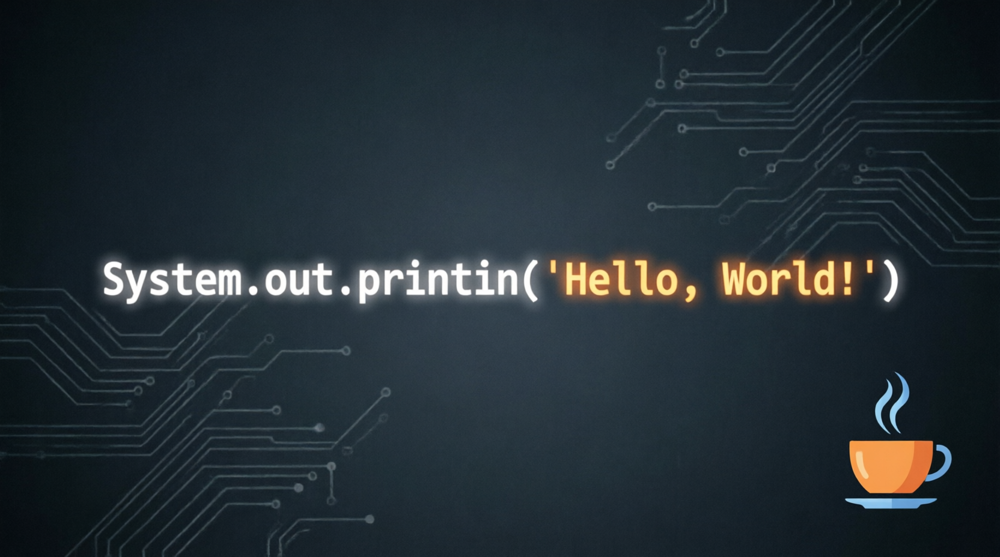

  
  
  <h1>
    <code>System.out.println("Hello, World!");</code>
  </h1>
  
  
<strong>Java • Spring • AI • Education</strong>

<!-- 

  

 -->

### About Me :

I am a **Java Developer**  and **Programming Teacher** from Russia.

- :telescope: I combine professional Java development with teaching programming to schoolchildren and students.
- :seedling: Developing my own lightweight Java framework: exploring DI, AOP, and clean API design from scratch.
- :zap: Integrating AI into everyday tools: experimenting with LLMs, prompt engineering, and Java-based ML pipelines.
- :computer: Passionate about clean code, backend architecture, and helping others grow in tech.

### Languages and Tools :

  &nbsp;
  &nbsp;
  &nbsp;
  &nbsp;
  &nbsp;
  &nbsp;
  &nbsp;
  &nbsp;
  

### :fire: My Stats :

